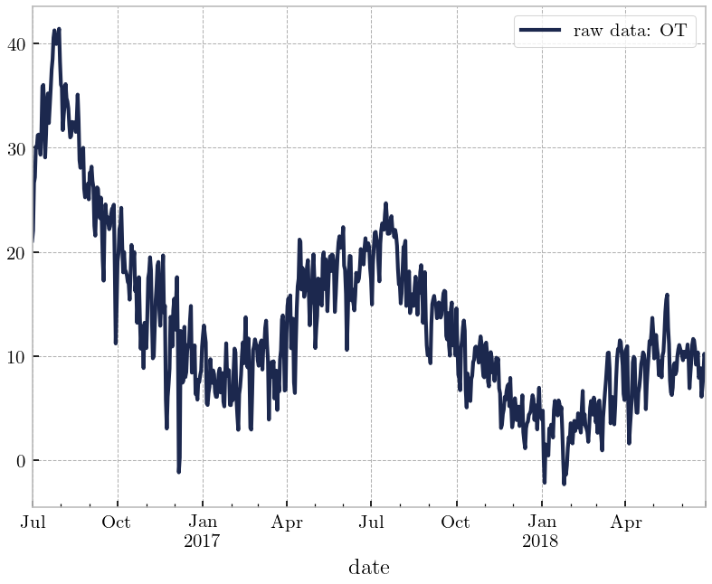
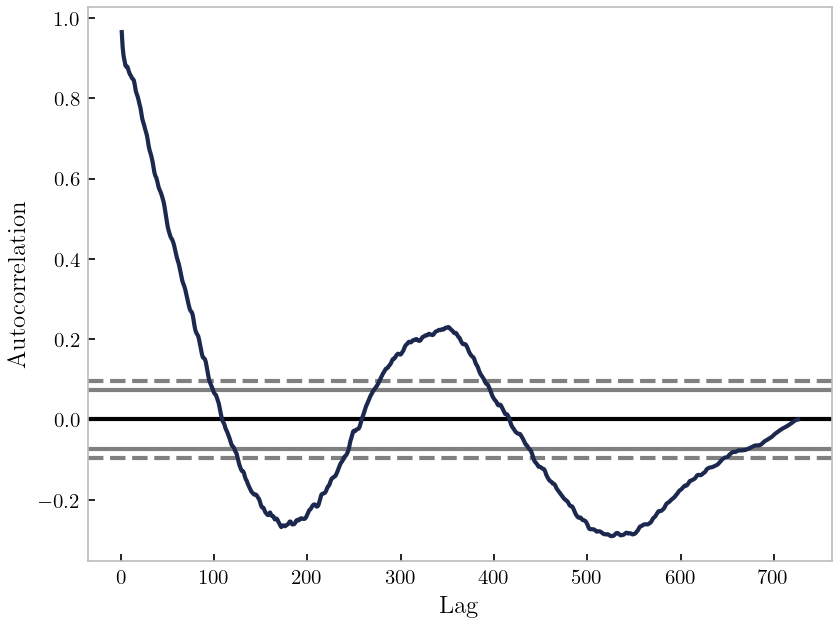
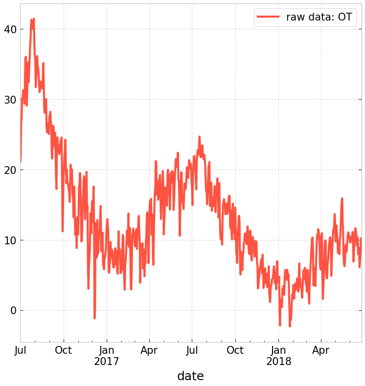
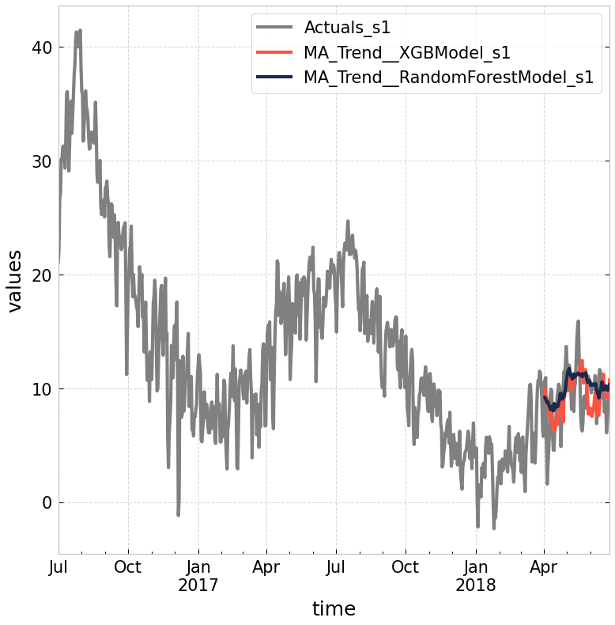
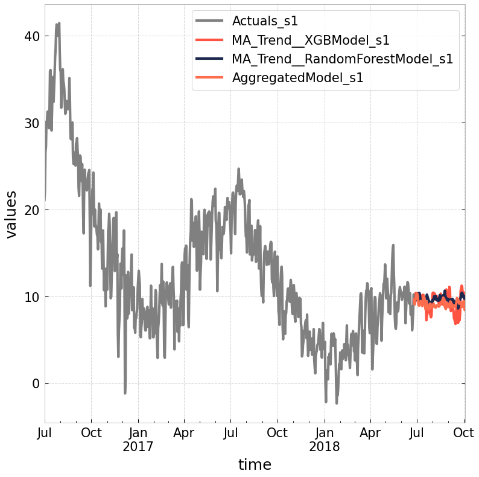
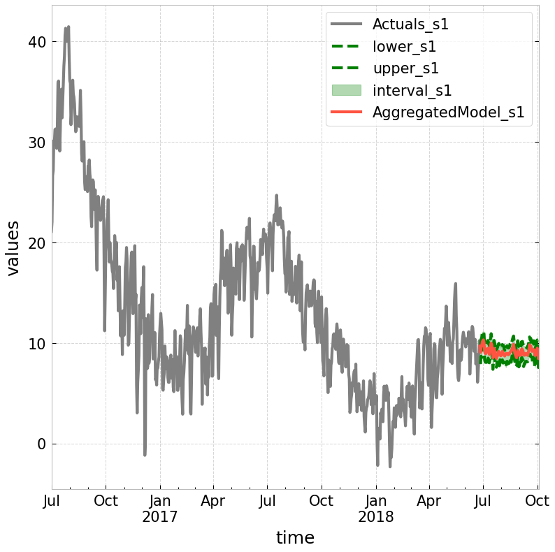
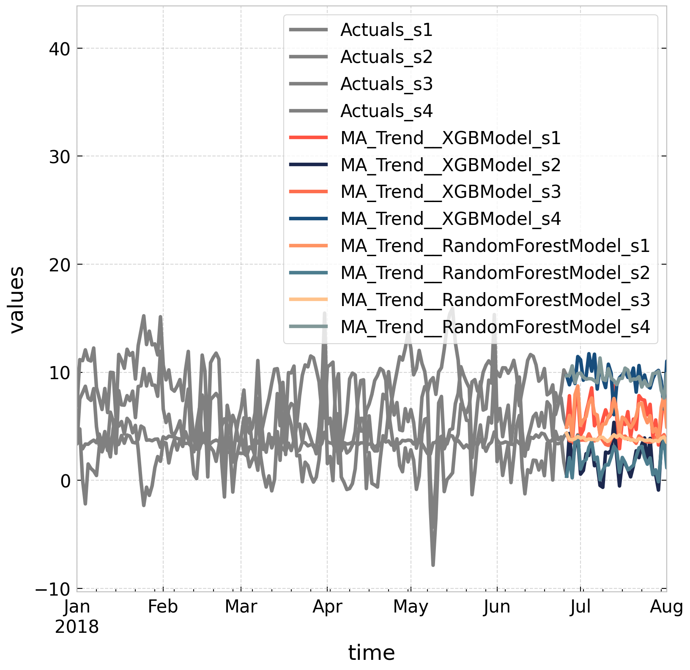

# PASTS — Python AnalySis for Time Series

[](https://docs.pytest.org)
[](https://GitHub.com/eurobios-mews-labs/pasts/graphs/commit-activity)

A unified interface for time series analysis and forecasting. All models — parametric (e.g. linear trend), ML/DL (via [Darts](https://unit8co.github.io/darts/)), and ensembles — share the same `TimeSeriesModel` interface.

### Features

+ **Statistical testing** — stationarity, seasonality, normality, white noise, heteroscedasticity, Granger causality
+ **Decomposition** — imperative workflow with automatic recomposition: trend removal, scaling, arbitrary transforms
+ **Visualization** — `signal.plot` accessor with matplotlib and Plotly backends
+ **Pluggable models** — `LinearTrend`, `MovingAverageTrend`, `HPFilterTrend`, `STLTrend`, `EMDTrend`, `HighPassFilterTrend`, `Differencing`, `DartsModel`, `AggregatedModel`

### Installation

```bash
pip install git+https://github.com/eurobios-mews-labs/pasts
```

## Architecture

```
Signal (extends DataCube)
├── TimeSeriesModel (ABC)            — unified fit / transform / reverse_transform
│   ├── LinearTrend                  — linear parametric model
│   ├── NonParametricTrend           — MovingAverage, HPFilter, STL, EMD, HighPassFilter
│   ├── DartsModel                   — wraps any Darts ML/DL estimator
│   └── AggregatedModel              — RMSE-weighted ensemble
├── Decomposition                    — records and reverses signal transformations
├── ValidationAccessor (.validation) — train/test splits, optional cross-validation
├── StatAccessor (.stat)             — statistical tests per column
├── Metrics                          — R², MSE, RMSE, MAPE, SMAPE, MAE
└── PlotAccessor (.plot)             — matplotlib / Plotly plots
```

**Typical workflow:**
1. `signal.stat.test_*()` — run statistical tests
2. `signal.validation_split()` — define train/test boundary
3. `signal.decompose()` + `signal.decompositions["name"].apply_model()` — decompose and fit models
4. `signal.forecast()` — predict through decomposition back to original space
5. `signal.compute_scores()` — evaluate metrics on held-out set
6. `signal.apply_model(AggregatedModel(...))` — combine models weighted by RMSE

Full example: [`examples/readme/model.py`](examples/readme/model.py)

## Quick start

### Load data

```python
import pandas as pd
from darts.datasets import ETTh1Dataset
from pasts.signal import Signal

# Electricity Transformer Temperature — 7 variables (6 power loads + oil temperature)
# Hourly data from 2016-07 to 2018-06 (~17 400 observations)
series = ETTh1Dataset().load()
df_all = pd.DataFrame(series.values())
df_all.columns = ['HUFL', 'HULL', 'MUFL', 'MULL', 'LUFL', 'LULL', 'OT']
df_all.index = series.time_index

# Resample to daily frequency for manageable computation
df_daily = df_all.resample('D').mean()

# Focus on Oil Temperature (OT), the main target variable
dt = df_daily[['OT']]
signal = Signal(dt, path='examples/readme/ETTh1_univariate')
```

### Statistical tests

All tests return a `pd.DataFrame` and are applied per-column on multivariate data.
Results are also stored in `signal.tests_stat`.

```python
signal.stat.test_stationarity()
signal.stat.test_stationarity(method='kpss')
signal.stat.test_seasonality()
```

### Visualization

```python
signal.plot()        # raw signal
signal.plot.acf()    # autocorrelation function
```




### Train/test split

```python
timestamp = '2018-04-01'
signal.validation_split(timestamp=timestamp)

signal.train_data   # pd.DataFrame — computed on demand
signal.test_data    # pd.DataFrame — computed on demand
```

`signal.validation.split(timestamp)` is the accessor form; both are equivalent.

### Decomposition

Named decompositions allow trend removal while keeping everything linked to the parent signal.
The split defined on the parent is automatically shared with each decomposition.

```python
from pasts.components import MovingAverageTrend

signal.decompose("MA_Trend")
signal.decompositions["MA_Trend"] -= MovingAverageTrend(30)
```

Each operation is recorded symbolically; `compose()` walks the stack in reverse to reconstruct
the original signal from a predicted residual.



Available trend components:

| Component | Description |
|-----------|-------------|
| `LinearTrend` | Linear parametric model |
| `MovingAverageTrend` | Moving average filter |
| `HPFilterTrend` | Hodrick-Prescott filter |
| `STLTrend` | STL decomposition |
| `EMDTrend` | Empirical Mode Decomposition |
| `HighPassFilterTrend` | High-pass frequency filter |
| `Differencing` | Transform-based detrending via `DataCube.apply()` |

### Fitting models

Models are applied directly on a named decomposition.
`save_model=True` persists the fitted estimator and its predictions to disk (joblib, under `signal.path`).

```python
from darts.models import XGBModel, RandomForestModel

signal.decompositions["MA_Trend"].apply_model(XGBModel(lags=250), save_model=True)
signal.decompositions["MA_Trend"].apply_model(RandomForestModel(lags=250), save_model=True)
```

### Forecast

`forecast()` composes predictions back to the original signal space through the decomposition.
`signal.models["MA_Trend__XGBModel"]` is populated with the composed predictions afterwards.

```python
signal.forecast("MA_Trend__XGBModel", 100, save_model=True)
signal.forecast("MA_Trend__RandomForestModel", 100, save_model=True)
```

### Scores

```python
signal.compute_scores()
```

Available metrics: `r2`, `mse`, `rmse`, `mape`, `smape`, `mae`.

```python
signal.plot.predictions()    # predictions vs actual
```



### Aggregated model

`AggregatedModel` combines models weighted by their RMSE on test data.

```python
from pasts.components.aggregated_model import AggregatedModel

signal.apply_model(AggregatedModel(
    {'MA_Trend__XGBModel': signal.models['MA_Trend__XGBModel']['model'],
     'MA_Trend__RandomForestModel': signal.models['MA_Trend__RandomForestModel']['model']},
), save_model=True)
signal.compute_scores(axis=1)
signal.compute_conf_intervals()
signal.forecast("AggregatedModel", 100, save_model=True)
```

```python
signal.plot.forecast()                        # all models
signal.plot.forecast(aggregated_only=True)    # aggregated model only
```




## Multivariate

The same workflow applies to multivariate data. `test_causality()` is available for multivariate signals.

```python
df_m = df_daily[['HUFL', 'MUFL', 'LUFL', 'OT']]
signal_m = Signal(df_m, path='examples/readme/ETTh1_multivariate')

signal_m.stat.test_causality()

timestamp = '2018-04-01'
signal_m.validation_split(timestamp=timestamp)

signal_m.decompose("MA_Trend")
signal_m.decompositions["MA_Trend"] -= MovingAverageTrend(30)

lags = [-325]
signal_m.decompositions["MA_Trend"].apply_model(XGBModel(lags=lags), save_model=True)
signal_m.decompositions["MA_Trend"].apply_model(RandomForestModel(lags=lags), save_model=True)

signal_m.forecast("MA_Trend__XGBModel", 50, save_model=True)
signal_m.forecast("MA_Trend__RandomForestModel", 50, save_model=True)
signal_m.compute_scores(axis=1)

signal_m.apply_model(AggregatedModel(
    {'MA_Trend__XGBModel': signal_m.models['MA_Trend__XGBModel']['model'],
     'MA_Trend__RandomForestModel': signal_m.models['MA_Trend__RandomForestModel']['model']},
), save_model=True)
signal_m.compute_scores()

signal_m.forecast("AggregatedModel", 50, save_model=True)
```



## Documentation

```bash
pip install sphinx sphinx_rtd_theme
cd doc && make html
```

Then open `doc/_build/html/index.html`.

---


